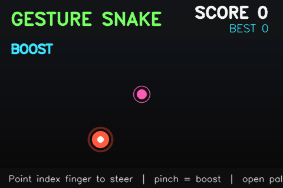

# 🖐️ Gesture Snake

Control classic Snake with nothing but your hand and a webcam. No keyboard, no mouse, no controller — just point, pinch, and play.




## Why this project

Most Snake clones are grid-locked and keyboard-driven. This one throws that out: the snake's head continuously chases your fingertip in real time, using [MediaPipe](https://ai.google.dev/edge/mediapipe/solutions/vision/hand_landmarker)'s hand-landmark model for tracking and OpenCV for a fully custom, glowing neon HUD — all rendered live over your camera feed, no game engine required.

**Controls, entirely gesture-based:**

| Gesture | Action |
|---|---|
| ☝️ Point index finger | Steer the snake |
| 🤏 Pinch (thumb + index) | Boost speed |
| ✋ Open palm | Pause |
| — | `R` restart · `Q` quit (keyboard, for convenience) |

## How it works

```
Webcam frame
     │
     ▼
HandTracker (src/hand_tracker.py)   ── MediaPipe HandLandmarker: fingertip position,
     │                                  pinch distance, open-palm heuristic
     ▼
SnakeGame (src/game.py)             ── Pure game-state logic, no CV/graphics
     │                                  dependencies. Head eases toward the
     │                                  fingertip target; body is a trail of
     │                                  past positions; food + collision rules.
     ▼
ui.py                               ── Renders the dimmed camera feed, neon
                                        snake/food, HUD, and pause/game-over
                                        overlays with OpenCV primitives.
```

The three layers don't know about each other's internals — `SnakeGame` in particular is plain Python with no camera or OpenCV dependency, which is what makes it possible to unit-test the whole game logic in milliseconds (see [`tests/`](tests/)) and to generate the demo GIF above from a *synthetic* fingertip path rather than a screen recording (see [`scripts/generate_demo.py`](scripts/generate_demo.py)).

## Getting started

**Requirements:** Python 3.10+, a webcam, and camera permission granted to your terminal/IDE.

```bash
git clone https://github.com/<your-username>/gesture-snake.git
cd gesture-snake

python -m venv .venv
source .venv/bin/activate        # Windows: .venv\Scripts\activate

pip install -r requirements.txt
python scripts/download_model.py  # one-time, ~8 MB hand-landmark model
python main.py
```

On first launch, your OS will prompt for camera access — allow it. If you don't see the permission prompt (common on macOS if you're running from a terminal), grant camera access manually in **System Settings → Privacy & Security → Camera**.

### Options

```bash
python main.py --camera 1        # use a different webcam
python main.py --width 1280 --height 720
```

## Running the tests

The game logic is fully decoupled from the camera, so the test suite runs instantly with no hardware:

```bash
pip install pytest
pytest tests/ -v
```

CI runs this same suite on Python 3.10–3.12 on every push (see [`.github/workflows/ci.yml`](.github/workflows/ci.yml)).

## Project structure

```
gesture-snake/
├── main.py                    # webcam loop, ties tracker + game + UI together
├── src/
│   ├── hand_tracker.py        # MediaPipe HandLandmarker wrapper
│   ├── game.py                # pure game-state logic (no CV dependencies)
│   └── ui.py                  # OpenCV rendering: HUD, snake, overlays
├── scripts/
│   ├── download_model.py      # fetches the hand-landmark model file
│   └── generate_demo.py       # renders assets/demo.gif from synthetic input
├── tests/
│   └── test_game.py           # unit tests for SnakeGame
└── assets/
    └── demo.gif
```

## Ideas for extending this

- Two-hand multiplayer (race to the most food)
- Swap the heuristic gesture detection for a trained gesture classifier
- A `--record` flag to save your own gameplay clips
- Port the rendering layer to `pygame` for smoother animation at high frame rates

## License

MIT — see [LICENSE](LICENSE).
